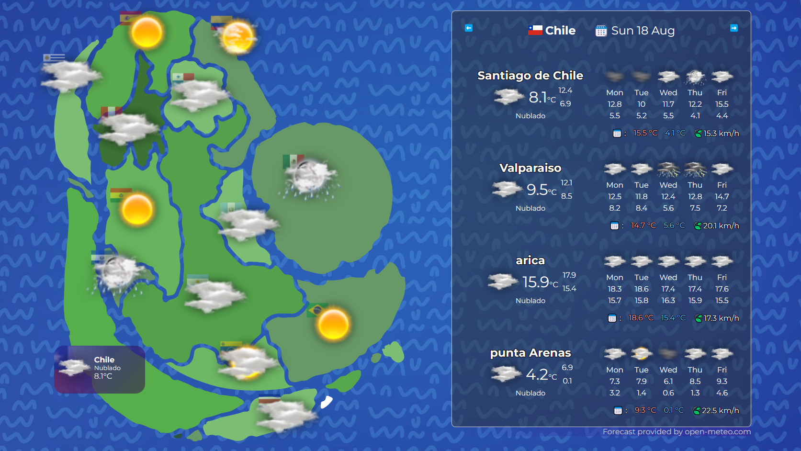

## Wacamoclima v3.0 🥑

```Version : v3.0.0 using Tauri v2.0```

Desktop application to present a fantasy map with real time weather information fron diferents countries using Tauri/NextJs and taking the data from Open Meteo API.



## Cool Features

- [x] Is a desktop app !
- [ ] and a mobile app !!!
- [x] with automatic updates
- [x] 🌞 Real time weather information
- [x] 🗺️ Cute map with the weather of different capitals cities.
- [x] ☀️ Weather of important citye of the selected country.
- [x] 📅 Provide current time and weather in city
- [x] 🔮 5 days forecast
- [x] 🌡 Max and Min temp for all 5 days forecast
- [x] 🌈 Cute icons!
- [ ] 🔎 Search City Forecast

## development

First init out project

```
pnpm install

pnpm tauri dev

# in android development
pnpm tauri android init
pnpm tauri android dev
```

### update dependencies

```
pnpm update @tauri-apps/cli @tauri-apps/api --latest

pnpm outdated @tauri-apps/cli
```

cargo dependencies

```
cd src-tauri
cargo update
```

### Rust console

```
// unix/osx
RUST_BACKTRACE=1 tauri dev

// cmd version
set RUST_BACKTRACE=1
tauri dev

// powershell version
$env:RUST_BACKTRACE=1
tauri dev
```

### Publishing
to publish the app and create an installable package simply run

```
pnpm tauri build
```

a key is needed to publish new versions and the autoupdater get it.
[reference](https://tauri.app/v1/guides/distribution/updater/)

also the following Environment  Variable is needed in the builder machine.

```
TAURI_SIGNING_PRIVATE_KEY : required
TAURI_SIGNING_PRIVATE_KEY_PASSWORD : optional
```
### Publishing on Android

to publish and create an Android APK simply run the next command

```cmd
pnpm tauri android init
pnpm tauri android build --apk
```


## First version project: 
[Wacamorning-map v1](https://github.com/msierraltav/waca-morning/tree/vue-first-version/wacamoclima-ui)


## Troubleshoting


### OpenSSL on Windows 11

On Windows 11 I had a lot of issues with OpenSSL , was not possible to detect the installation of it.
to solve it is necessary to install OpenSSL , and use the following reqewst package into Cargo.toml

Error with OpenSSL on Windows 11 : https://www.wilivm.com/blog/install-openssl-on-windows-10-11/ 

```toml
//Cargo.toml
reqwest = { version = "0.12.7", default-features = false, features = ["rustls-tls"] }
```